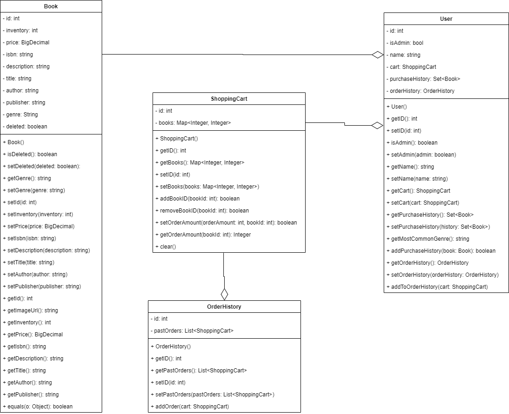
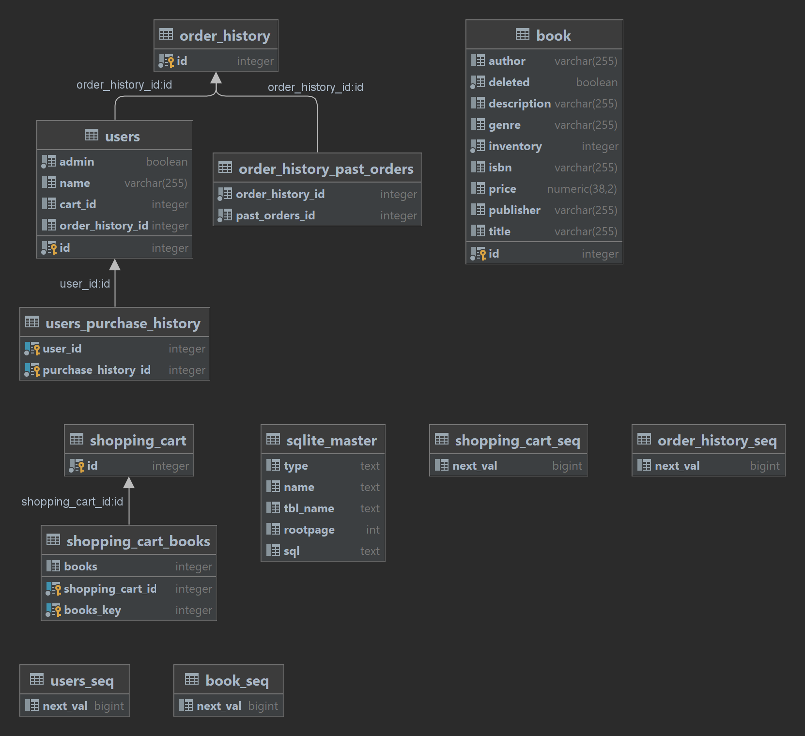

# SYSC 4806 Project - Group 7

Chosen topic: Amazin Bookstore & FaaS, Microservices, Amazon Lambda

> Bookstore Owner can upload and edit Book information (ISBN, picture, description, author, publisher,...) and inventory. 
> User can search for, and browse through, the books in the bookstore, sort/filter them based on the above information. 
> User can then decide to purchase one or many books by putting them in the Shopping Cart and proceeding to Checkout. 
> The purchase itself will obviously be simulated, but purchases cannot exceed the inventory. 
> User can also view Book Recommendations based on past purchases. 
> This is done by looking for users whose purchases are most similar (using Jaccard distance: Google it!), 
> and then recommending books purchased by those similar users but that the current User hasn't yet purchased.

### Deadlines

- Milestone 1: March 8 2023
- Milestone 2: March 22 2023
- Group Presentation: March 26 2023
- Milestone 3: April 5 2023

### Team members
- Phuc La (101107588)
- Nicolas Tuttle (101105699)
- Robell Gabriel (101108508)

#### How to run the project
1. Package Maven
2. Run Sysc4806ProjectApplication.class

#### Class Diagram

#### Database Schema

#### Milestone 1

In milestone 1, our team built the framework of the Amazin BookStore with many features implemented. Features created in this milestone: 
- Create new book for the store (upload new book to the store):
  - Bookstore owner or admin can add new book into the store.
- Edit book (update book information such as description and inventory):
  - Bookstore owner or admin can edit the information of the pre-existing book in the store by changing the description or update inventory manually.
- Delete book from the store page:
  - Bookstore owner or admin can delete a book from the store page, which completely removes it from the system.
- Adding books into shopping cart
  - Users can add book into their respective online shopping cart.
  - Naturally, the number of books that the user add to cart cannot exceed the number of books in inventory.
- Searching for book(s) based on ISBN, Publisher, Author and Title
  - All the searching is done with case-insensitive contains logic.
  - The only exception is the ISBN since it is unique for each book.

The team's plan for milestone 2 is:
- Implement the Checkout feature
- Adding recommendation purchase feature based on what the user purchased in the past
- Implement the features in the bookstore using the AWS Lambda function
- Create and change active users

#### Milestone 2

In milestone 2, our team enhanced the features implemented in milestone 1.
- Add purchase recommendations for users
  - User model now holds a purchase history
  - Genre field added to Book to help with recommendations
- Add login/signup feature to manage users
  - Signup requires a unique username
  - Login only requires a username, user authentication is outside the scope of this project
- Add checkout feature
  - Books now have a cost associated with them
  - Automatically updates inventory
  - Presents a total cost, asks for shipping + billing info
- Small refactor to make User own a ShoppingCart instead of the other way around
  - Makes checkout function and login/logout easier to manage
- Configure a separate database for testing
  - Avoids cluttering the local database with test entries when running tests locally
- Add an Azure Function to calculate shipping costs
  - Deployed as a separate project
  - Allows users to select from 3 different shipping options

The team's plan for milestone 3 is:
- Add more Azure Functions to demo their capabilities to a greater extent (shipping timelines, create return label, etc.)
- Enhance recommendations to use Jaccard Distance in addition to genre data
- Create an order history page, optionally add a review option

#### Milestone 3

In milestone 3, our team enhanced the features implemented in milestone 2 and added new ones.
- Modified purchase recommendations
  - still recommends books based off genre but now uses Jaccard distance algorithm
- Add login/signup feature to manage users
  - Signup requires a unique username
  - Login only requires a username, user authentication is outside the scope of this project
- Add checkout feature
  - Books now have a cost associated with them
  - Automatically updates inventory
  - Presents a total cost, asks for shipping + billing info
- Small refactor to make User own a ShoppingCart instead of the other way around
  - Makes checkout function and login/logout easier to manage
- Configure a separate database for testing
  - Avoids cluttering the local database with test entries when running tests locally
- Add an Azure Function to show different shipping timelines
  - Deployed under a separate project
  - Allows users to select from 3 different shipping options

The team's plan for milestone 3 is:
- Add more Azure Functions to demo their capabilities to a greater extent (shipping timelines, create return label, etc.)
- Enhance recommendations to use Jaccard Distance in addition to genre data
- Create an order history page, optionally add a review option
